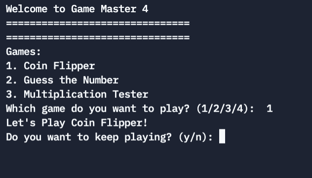

# Instructions  

  **Create a Game Menu program that allows the User to play 4 or more different games

Work with the others to mmake work load easier.

  
  
  
Goals: 
Your version should have at least 4 games

Extras:
Use functions for each game
Put all of your functions in a separate file. (See Example Here )
Come up with a way to keep points for each game and carry it through to other games

Post on Padlet 

 **

  _
  